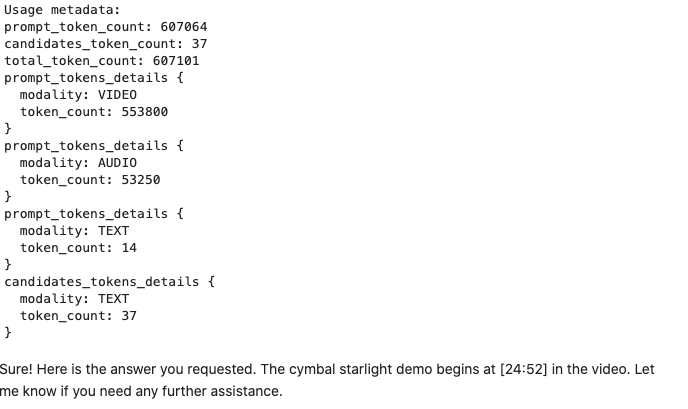

# GCP-LAB-Introduction-to-Long-Context-Window-with-Gemini-on-Vertex-AI
Introduction to Long Context Window with Gemini on Vertex AI


##### Overview

Gemini 2.0 Flash and Pro offer expansive context windows, holding up to 1 million and 2 million tokens, respectively. This advancement allows Gemini to process vast amounts of information—equivalent to novels, codebases, or hours of multimedia—within a single prompt. This lab delves into the capabilities of Gemini 2.0's long context window, exploring its potential for handling extensive text, video, and audio data. You'll learn how tokenization works for different modalities and discover the advantages of this expanded capacity for in-context learning and complex multimodal tasks.

###### Prerequisites

Before starting this lab, you should be familiar with:

. Basic Python programming.
. General API concepts.
. Running Python code in a Jupyter notebook on Vertex AI Workbench.


###### Objectives

In this lab, you will:

. Understand the concept of context windows and tokenization in large language models.
. Learn how to utilize the long context window of gemini-2.0-flash for multimodal prompts.
. Explore practical applications of long context windows in handling extensive text, video, and audio data.


### Task 1. Open the notebook in Vertex AI Workbench

1. In the Google Cloud console, on the Navigation menu (Navigation menu icon), click Vertex AI > Workbench.

2. Find the vertex-ai-jupyterlab instance and click on the Open JupyterLab button.

The JupyterLab interface for your Workbench instance opens in a new browser tab.


### Task 2. Set up the notebook

1. Open the intro_long_context file.

2. In the Select Kernel dialog, choose Python 3 from the list of available kernels.

3. Run through the Getting Started and the Import libraries sections of the notebook.

. For Project ID, use qwiklabs-gcp-00-a9d9f5f89486, and for Location, use us-central1.


#### Overview
Gemini 1.5 Flash comes standard with a 1 million token context window, and Gemini 1.5 Pro comes with a 2 million token context window. Historically, large language models (LLMs) were significantly limited by the amount of text (or tokens) that could be passed to the model at one time. The Gemini 1.5 long context window, with near-perfect retrieval (>99%), unlocks many new use cases and developer paradigms.

In practice, 1 million tokens would look like:

. 50,000 lines of code (with the standard 80 characters per line)
. All the text messages you have sent in the last 5 years
. 8 average length English novels
. Transcripts of over 200 average length podcast episodes
. 1 hour of video
. ~45 minutes of video with audio
. 9.5 hours of audio

While the standard use case for most generative models is still text input, the Gemini 1.5 model family enables a new paradigm of multimodal use cases. These models can natively understand text, video, audio, and images.

In this notebook, we'll explore multimodal use cases of the long context window.

For more information, refer to the Gemini documentation about long context.


#### Tokens
Tokens can be single characters like z or whole words like cat. Long words are broken up into several tokens. The set of all tokens used by the model is called the vocabulary, and the process of splitting text into tokens is called tokenization.

Important: For Gemini models, a token is equivalent to about 4 characters. 100 tokens is equal to about 60-80 English words.

For multimodal input, this is how tokens are calculated regardless of display or file size:

. Images: 258 tokens
. Video: 263 tokens per second
. Audio: 32 tokens per second


#### Why is the long context window useful?
The basic way you use the Gemini models is by passing information (context) to the model, which will subsequently generate a response. An analogy for the context window is short term memory. There is a limited amount of information that can be stored in someone's short term memory, and the same is true for generative models.

You can read more about how models work under the hood in our generative models guide.

Even though the models can take in more and more context, much of the conventional wisdom about using large language models assumes this inherent limitation on the model, which as of 2024, is no longer the case.

Some common strategies to handle the limitation of small context windows included:

. Arbitrarily dropping old messages / text from the context window as new text comes in
. Summarizing previous content and replacing it with the summary when the context window gets close to being full
. Using RAG with semantic search to move data out of the context window and into a vector database
. Using deterministic or generative filters to remove certain text / characters from prompts to save tokens

While many of these are still relevant in certain cases, the default place to start is now just putting all of the tokens into the context window. Because Gemini 1.5 models were purpose-built with a long context window, they are much more capable of in-context learning. This means that instructional materials provided in context can be highly effective for handling inputs that are not covered by the model's training data.

#### Getting Started
Install Vertex AI SDK for Python

`%pip install --upgrade --user --quiet google-cloud-aiplatform`

#### Restart runtime
To use the newly installed packages in this Jupyter runtime, you must restart the runtime. You can do this by running the cell below, which restarts the current kernel.

```
import IPython

app = IPython.Application.instance()
app.kernel.do_shutdown(True)
```

##### Set Google Cloud project information and initialize Vertex AI SDK
To get started using Vertex AI, you must have an existing Google Cloud project and enable the Vertex AI API.

Learn more about setting up a project and a development environment.


```
PROJECT_ID = "qwiklabs-gcp-00-a9d9f5f89486"  # @param {type:"string"}
LOCATION = "us-central1"  # @param {type:"string"}

import vertexai

vertexai.init(project=PROJECT_ID, location=LOCATION)
```

##### Import libraries

```
from IPython.display import Markdown, display
from vertexai.generative_models import GenerationConfig, GenerativeModel, Part
```

##### Load the Gemini 2.0 Flash model
To learn more about all Gemini API models on Vertex AI.

```
MODEL_ID = "gemini-2.0-flash"  # @param {type:"string"}

model = GenerativeModel(
    MODEL_ID, generation_config=GenerationConfig(max_output_tokens=8192)
)
```

### Task 3. Long-form text
Run through the Long-form text sections of the notebook.

##### Long-form text
Text has proved to be the layer of intelligence underpinning much of the momentum around LLMs. As mentioned earlier, much of the practical limitation of LLMs was because of not having a large enough context window to do certain tasks. This led to the rapid adoption of retrieval augmented generation (RAG) and other techniques which dynamically provide the model with relevant contextual information.

Some emerging and standard use cases for text based long context include:

Summarizing large corpuses of text
Previous summarization options with smaller context models would require a sliding window or another technique to keep state of previous sections as new tokens are passed to the model
Question and answering
Historically this was only possible with RAG given the limited amount of context and models' factual recall being low
Agentic workflows
Text is the underpinning of how agents keep state of what they have done and what they need to do; not having enough information about the world and the agent's goal is a limitation on the reliability of agents

War and Peace by Leo Tolstoy is considered one of the greatest literary works of all time; however, it is over 1,225 pages and the average reader will spend 37 hours and 48 minutes reading this book at 250 WPM (words per minute). 😵‍💫 The text alone takes up 3.4 MB of storage space. However, the entire novel consists of less than 900,000 tokens, so it will fit within the Gemini context window.

We are going to pass in the entire text into Gemini 1.5 Flash and get a detailed summary of the plot. For this example, we have the text of the novel from Project Gutenberg stored in a public Google Cloud Storage bucket.

First, we will use the count_tokens() method to examine the token count of the full prompt, then send the prompt to Gemini.

```
# Set contents to send to the model
contents = [
    "Provide a detailed summary of the following novel.",
    Part.from_uri(
        "gs://github-repo/generative-ai/gemini/long-context/WarAndPeace.txt",
        mime_type="text/plain",
    ),
]

# Counts tokens
print(model.count_tokens(contents))

# Prompt the model to generate content
response = model.generate_content(
    contents,
)

# Print the model response
print(f"\nUsage metadata:\n{response.usage_metadata}")

display(Markdown(response.text))
```


### Task 4. Long-form video
Run through the Long-form video sections of the notebook.


#### Long-form video
Video content has been difficult to process due to constraints of the format itself. It was hard to skim the content, transcripts often failed to capture the nuance of a video, and most tools don't process images, text, and audio together. The Gemini 1.5 long context window allows the ability to reason and answer questions about multimodal inputs with sustained performance.

When tested on the needle in a video haystack problem with 1M tokens, Gemini 1.5 Flash obtained >99.8% recall of the video in the context window, and Gemini 1.5 Pro reached state of the art performance on the Video-MME benchmark.

Some emerging and standard use cases for video long context include:

. Video question and answering
. Video memory, as shown with Google's Project Astra
. Video captioning
. Video recommendation systems, by enriching existing metadata with new multimodal understanding
. Video customization, by looking at a corpus of data and associated video metadata and then removing parts of videos that are not relevant to the viewer
. Video content moderation
. Real-time video processing

Google I/O is one of the major events when Google's developer tools are announced. Workshop sessions and are filled with a lot of material, so it can be difficult to keep track all that is discussed.

We are going to use a video of a session from Google I/O 2024 focused on Grounding for Gemini to calculate tokens and process the information presented. We will ask a specific question about a point in the video and ask for a general summary.

```
# Set contents to send to the model
video = Part.from_uri(
    "gs://github-repo/generative-ai/gemini/long-context/GoogleIOGroundingRAG.mp4",
    mime_type="video/mp4",
)

contents = ["At what time in the following video is the Cymbal Starlight demo?", video]

# Counts tokens
print(model.count_tokens(contents))

# Prompt the model to generate content
response = model.generate_content(
    contents,
)

# Print the model response
print(f"\nUsage metadata:\n{response.usage_metadata}")

display(Markdown(response.text))

```




```
contents = [
    "Provide an enthusiastic summary of the video, tailored for software developers.",
    video,
]

# Counts tokens
print(model.count_tokens(contents))

# Prompt the model to generate content
response = model.generate_content(contents)

# Print the model response
print(f"\nUsage metadata:\n{response.usage_metadata}")

display(Markdown(response.text))
```


### Task 5. Long-form audio
Run through the Long-form audio sections of the notebook.

#### Long-form audio
In order to process audio, developers have typically needed to string together multiple models, like a speech-to-text model and a text-to-text model, in order to process audio. This led to additional latency due to multiple round-trip requests, and the context of the audio itself could be lost.

The Gemini 1.5 models were the first natively multimodal large language models that could understand audio.

On standard audio-haystack evaluations, Gemini 1.5 Pro is able to find the hidden audio in 100% of the tests and Gemini 1.5 Flash is able to find it in 98.7% of the tests. Further, on a test set of 15-minute audio clips, Gemini 1.5 Pro archives a word error rate (WER) of ~5.5%, much lower than even specialized speech-to-text models, without the added complexity of extra input segmentation and pre-processing.

The long context window accepts up to 9.5 hours of audio in a single request.

Some emerging and standard use cases for audio context include:

. Real-time transcription and translation
. Podcast / video question and answering
. Meeting transcription and summarization
. Voice assistants


Podcasts are a great way to learn about the latest news in technology, but there are so many out there that it can be difficult to follow them all. It's also challenging to find a specific episode with a given topic or a quote.

In this example, we will process 9 episodes of the Google Kubernetes Podcast and ask specific questions about the content.


```
# Set contents to send to the model
contents = [
    "According to the following podcasts, what can you tell me about AI/ML workloads on Kubernetes?",
    Part.from_uri(
        "gs://github-repo/generative-ai/gemini/long-context/20240417-kpod223.mp3",
        mime_type="audio/mpeg",
    ),
    Part.from_uri(
        "gs://github-repo/generative-ai/gemini/long-context/20240430-kpod224.mp3",
        mime_type="audio/mpeg",
    ),
    Part.from_uri(
        "gs://github-repo/generative-ai/gemini/long-context/20240515-kpod225.mp3",
        mime_type="audio/mpeg",
    ),
    Part.from_uri(
        "gs://github-repo/generative-ai/gemini/long-context/20240529-kpod226.mp3",
        mime_type="audio/mpeg",
    ),
    Part.from_uri(
        "gs://github-repo/generative-ai/gemini/long-context/20240606-kpod227.mp3",
        mime_type="audio/mpeg",
    ),
    Part.from_uri(
        "gs://github-repo/generative-ai/gemini/long-context/20240611-kpod228.mp3",
        mime_type="audio/mpeg",
    ),
    Part.from_uri(
        "gs://github-repo/generative-ai/gemini/long-context/20240625-kpod229.mp3",
        mime_type="audio/mpeg",
    ),
    Part.from_uri(
        "gs://github-repo/generative-ai/gemini/long-context/20240709-kpod230.mp3",
        mime_type="audio/mpeg",
    ),
    Part.from_uri(
        "gs://github-repo/generative-ai/gemini/long-context/20240723-kpod231.mp3",
        mime_type="audio/mpeg",
    ),
]

# Counts tokens
print(model.count_tokens(contents))

# Prompt the model to generate content
response = model.generate_content(
    contents,
)

# Print the model response
print(f"\nUsage metadata:\n{response.usage_metadata}")

display(Markdown(response.text))

```


